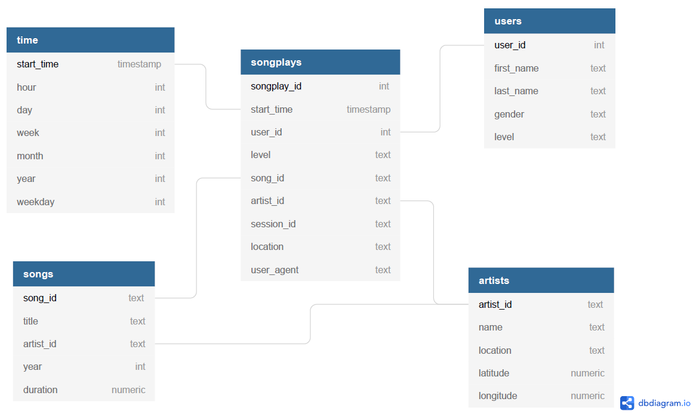

# :eye_speech_bubble: Project overview

Because the executive suite of the imaginary music streaming startup Sparkify kept hearing that "data is the oil of the 21st century", they decided to collect any data they could get their hands on about the songs they offer and their users' listening activity.

However, the data was collected in the from of individual JSON files, and the startup quickly realized that its data analysts and scientists are having a hard time leveraging the data that way. Hence, the executives decided to bring a data engineer onto the team to make the data available in a relational PostgreSQL database instead.

The project is part of the [Udacity Data Engineering nanodegree program](https://www.udacity.com/course/data-engineer-nanodegree--nd027).

# :goal_net: Analytical Goals

The analytics team has an interest in understanding which songs users are listening to and at which times they do so.

The main reasons are:
* Knowing how often songs from a specific artist were listened to is an important metric for paying song license fees to artists accordingly.
* Being aware of how many users are using their service at any given time of the day or the week allows Sparkify to plan server maintenances with the least impact on its users.
* Sparkify can analyze the songs that users are listening to in order to personalize their recommendations of new tracks for each of its users.

# :star2: Database Schema

The PostgreSQL database was modeled according to a Star schema, with the `songplays` table at its center. The schema is almost fully normalized, and the `songplays` table references the `songs` and `artists` tables which contain information about Sparkify's songs, as well as the `users` and `time` tables which store user and time information. The database schema is visualized below.



This data model makes sense as the songplays table contains the core information of which songs were listened to, and other data of interest can be easily added using `JOIN` operations with the respective foreign keys.

# :wrench: ETL Pipeline

First, the `sparkifydb` PostgreSQL database has to be set up. To do so, the [create_tables.py](create_tables.py) script, as the name suggests, creates the database tables by utilizing the respective table creation queries found in [sql_queries.py](sql_queries.py).

Then, the information from the songs and user log JSON files, which can be found in the `data` folder, need to be extracted, processed and inserted into the respective database tables. The required ETL processes are written in Python, utilizing [Pandas](https://pandas.pydata.org/) and the [pscopg2 PostgreSQL database adapter](https://pypi.org/project/psycopg2/). They were first developed in the [etl Jupyter Notebook](etl.ipynb) and then used in the [etl.py Python ETL script](etl.py).

Lastly, it is validated whether the data was inserted correctly using the [test Jupyter Notebook](test.ipynb).

# :question: Sample Queries

To address the previously outlined analytical goals, sample queries are provided in the [sample query Jupyter Notebook](analytical_sample_queries.ipynb).

For example, to find out how many songs of a certain artist were listened to in a given billing cycle (e.g. a month) by Sparkify's users, the following query can be used:
```sql
SELECT artists.name as "Artist Name", artists.artist_id as "Artist ID", COUNT(artists.artist_id) as "Amount of songs" 
FROM songplays 
JOIN artists ON (songplays.artist_id = artists.artist_id) 
JOIN time ON (songplays.start_time = time.start_time) 
WHERE time.year = 2021 AND time.month = 2 
GROUP BY artists.artist_id;
```

Or to find out how many songs are generally listened to across the hours of a week to determine when server maintenance work would have the least impact, the following query can be used:
```sql
SELECT time.weekday as weekday, time.hour as hour, COUNT(songplays.start_time) as song_count 
FROM songplays 
JOIN time ON (songplays.start_time = time.start_time) 
GROUP BY (time.weekday, time.hour) 
ORDER BY time.weekday ASC, time.hour ASC;
```

Lastly, to investigate the recent music taste of a certain user, the songs listened to (and how often each of these songs were listened) by a certain user in the last 10 days can be retrieved from the database:

```sql
SELECT songs.title as "Song title", COUNT(songs.song_id) as "times listened to"
FROM songplays
JOIN users ON (songplays.user_id = users.user_id)
JOIN songs ON (songplays.song_id = songs.song_id)
WHERE users.first_name = 'John'
AND users.last_name = 'Doe'
AND AGE(songplays.start_time) < '10 days'
GROUP BY users.user_id, songs.title;
```

# Summary
All in all, the developed database schema is effective and efficient in helping Sparkify's data scientists to retrieve the data they need for their analyses.

I had a lot of fun doing the project and am looking forward to the next project in the nanodegree!
